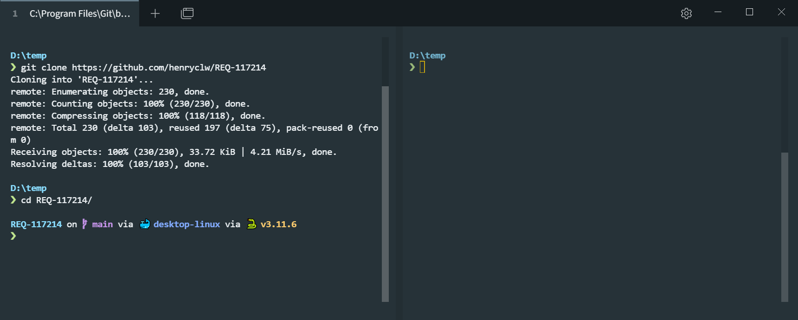
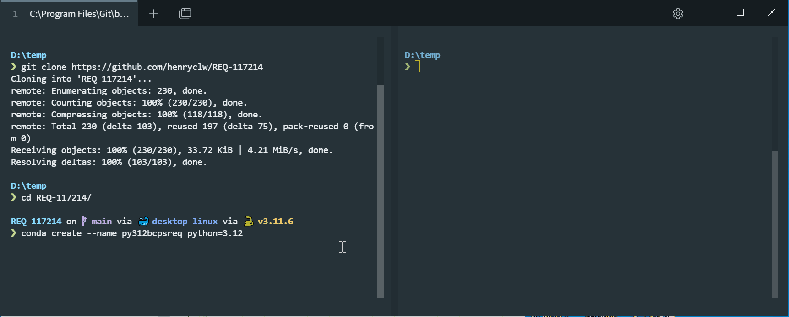
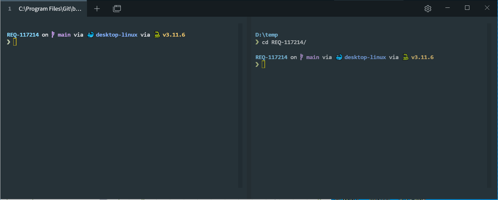
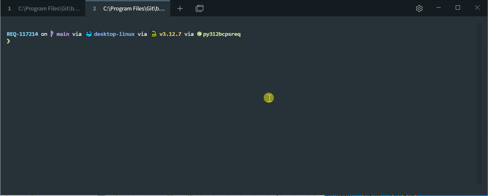
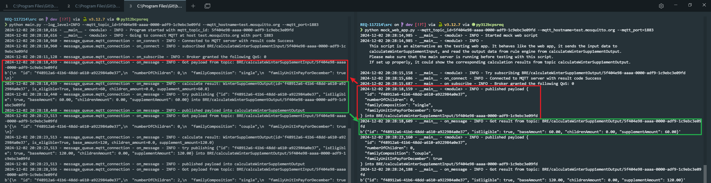
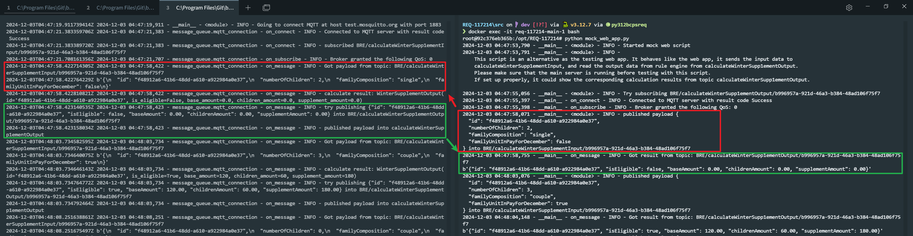

[TOC]

# REQ-117214

This repo is for BC Public Service REQ 117214

# Code test

Here is a document to guide you through the testing of this code.

## Clone repo

clone this repo

```bash
git clone https://github.com/henryclw/REQ-117214
cd REQ-117214
```



## Use conda and pip to setup python environment

Create conda environment

```bash
conda create --name py312bcpsreq python=3.12
conda activate py312bcpsreq

# If this command doesn't work, and you're using windows, you may try this command to activate the environment as well.
source activate py312bcpsreq
```



Use pip to install the dependencies

```bash
pip install -r ./requirements.txt --upgrade
```



## Run unittest

```bash
cd src
python -m unittest discover -s ./test -v
```



As you could see over here, all the unit test could be passed.

## Run demo

We have two method to run this app, the plain one and the docker one. Plain one is more for development usage. For production usage please refer to the docker one.

The arguments of MQTT topic id, hostname, port could be passed as command line or as environment variables as well.

| usage                             | required | command line args name | environment variable name | default value      |
| --------------------------------- | -------- | ---------------------- | ------------------------- | ------------------ |
| logging level of the main program | N        | log_level              | LOG_LEVEL                 | INFO               |
| MQTT topic id                     | Y        | mqtt_topic_id          | MQTT_TOPIC_ID             |                    |
| MQTT hostname to connect          | N        | mqtt_hostname          | MQTT_HOSTNAME             | test.mosquitto.org |
| MQTT port to connect              | N        | mqtt_port              | MQTT_PORT                 | 1883               |

### Plain method

This method includes setting up the main program and a mock web app

First, we would like to run the main program using this command:

```bash
cd src
python main.py --log_level=INFO --mqtt_topic_id=5f404e98-aaaa-0000-adf9-1c9ebc3e09fd --mqtt_hostname=test.mosquitto.org --mqtt_port=1883
```

The main program would automatically connect to the test mqtt server and would listen on the `BRE/calculateWinterSupplementInput/<MQTT topic ID>` topic. If it receive any valid message, it would do the calculation and output the result in `BRE/calculateWinterSupplementOutput/<MQTT topic ID>`

For demonstration, we could use a script that mock the behaviour of the web app (which is put something in the input topic and read the result in the output topic)

```bash
python mock_web_app.py --mqtt_topic_id=5f404e98-aaaa-0000-adf9-1c9ebc3e09fd --mqtt_hostname=test.mosquitto.org --mqtt_port=1883
```

Here is a (accelerated) gif showing the program running. The left side is the main program, the right side is the mock web app. As you could see over here, the mock web app sends the inputs and receive the results as expected, which means the main program is computing and functioning as expected.


The input is indicted as red and the output is indicted as green. The red payload started from the mock web app and was been received by the main program. The green result started from the main program and was been received by the mock web app.



### Docker method

Using docker is more robust and could be deployed on the server easily. It could track the code version using docker image hash and could be scaled as well. Here is a brief command to deploy the docker

```bash
# to rebuild with the latest code
docker compose up -d --build --force-recreate --no-deps
```


You could also start the mock web app from the docker container as well.

```bash
# at one window
docker logs -t -f req-117214-main-1

# at a seperate window
docker exec -it req-117214-main-1 bash
python mock_web_app.py
```


The input is indicted as red and the output is indicted as green. The red payload started from the mock web app and was been received by the main program. The green result started from the main program and was been received by the mock web app.



## Clean up

After testing the code, if you like to clean all the environments, you may use the following commands:

### conda

You may use this command to remove the conda environment after testing

```bash
conda remove -n py312bcpsreq --all
```

### docker

You may use this command to remove the docker compose

```bash
docker compose down
```

### repo

You may use this command to remove the whole repo

```bash
rm -r REQ-117214/
```

# Additional information

## GitHub CI/CD

The unit test and docker build test is automatically executed when the branch has some updates or there's a pull request into the main branch. Which could be showed:
[](https://github.com/henryclw/REQ-117214/actions/workflows/python_test.yml)
[](https://github.com/henryclw/REQ-117214/actions/workflows/docker_build_test.yml)

Having unit test could greatly enhance the code quality (because we could find out the low-quality code before merging)

## Possible improvement

Although the basic project goals have been met, there is still a lot of room for improvement:
- Return more errors into the MQTT if needed.
- Create a program or use some framework like Grafana to monitor the health of the server.
- Use ELK Stack if we need to have more accurate logs and better debug experience.
- If we have many complex rules
  - Log which rules it hits in order. This could make debugging easier if something is not as expected.
  - Log the computing time of the rule engine if the calculation process is slow.


## References

The sources that I referred to when during the development stage:

- MQTT
  - <https://pypi.org/project/paho-mqtt/>
  - <https://github.com/eclipse-paho/paho.mqtt.python>
- GitHub CI/CD
  - <https://docs.github.com/en/actions/use-cases-and-examples/building-and-testing/building-and-testing-python>
